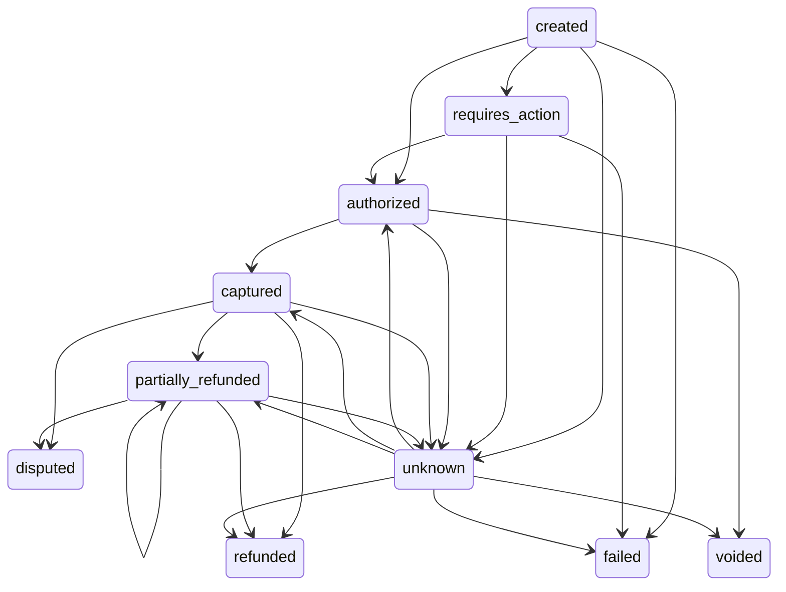

# ADR 0002: Ödeme durum makinesi

- Durum: Kabul edildi
- Tarih: 2026-10-07
- Kapsam: `crates/payos-domain`

## Bağlam

Ödeme durumu yanlış bir geçişle bozulursa para hareketi ile kayıt ayrışır:
örneğin capture edilmiş bir ödemenin tekrar yetkilendirilmesi ya da banka
zaman aşımında işlemin körlemesine tekrar gönderilmesi. Mimari doküman (3.6)
durumları ve geçişleri tanımlar; belirsiz banka yanıtında "tekrar gönderim
yok, önce sorgu" kuralını koyar.

Domain katmanı saf Rust'tır: veritabanı, ağ ve saat okuma yoktur. Zaman her
komuta parametre olarak verilir.

## Karar

### Durumlar ve geçiş tablosu

`PaymentStatus::can_transition_to` tek kaynak geçiş tablosudur:

| Kaynak | İzin verilen hedefler |
|---|---|
| created | requires_action, authorized, failed, unknown |
| requires_action | authorized, failed, unknown |
| authorized | captured, voided, unknown |
| captured | partially_refunded, refunded, disputed, unknown |
| partially_refunded | partially_refunded, refunded, disputed, unknown |
| unknown | authorized, failed, captured, voided, partially_refunded, refunded |
| failed, voided, refunded, disputed | yok (terminal) |

`disputed` uyuşmazlık sonuçlandırma akışı yazılana kadar terminaldir.

### Payment aggregate

- Alanlar private'tır; durum yalnızca komut metotlarıyla değişir.
- Her komut önce tüm kontrolleri yapar, sonra değişikliği uygular. Başarısız
  komut nesneyi hiç değiştirmez.
- `version` 1'den başlar ve her başarılı geçişte `checked_add(1)` ile artar;
  `updated_at` komuta verilen zamana ayarlanır. DB katmanı bu alanı koşullu
  `UPDATE ... WHERE version = $n` ile iyimser kilit olarak kullanır
  (ADR 0003).
- `updated_at` geriye gidemez: komuta verilen zaman son güncellemeden önceyse
  `TimestampBeforeLastUpdate` döner. Eşit zaman kabul edilir. Geçiş kuralı
  ihlali zaman hatasından önce raporlanır.
- Capture her zaman tam tutardır.
- İade: para birimi aynı olmalı, sıfır iade reddedilir, toplam iade capture
  tutarını aşamaz. Toplam eşitse `refunded`, değilse `partially_refunded`.

### Unknown: işlem-bilinçli yönetim

`mark_unknown(operation)` belirsiz kalan banka işlemini (`Authorize`,
`Capture`, `Void`, `Refund(tutar)`) ve önceki durumu saklar. İşlem mevcut
durumda geçerli değilse reddedilir. `Unknown` durumundayken
`resolve_unknown` dışındaki tüm komutlar reddedilir; işlem tekrar
gönderilemez.

| Bekleyen işlem | Approved | Declined |
|---|---|---|
| Authorize | authorized | failed |
| Capture | captured | authorized (önceki durum) |
| Void | voided | authorized (önceki durum) |
| Refund(tutar) | iade uygulanır: partially_refunded / refunded | önceki durum |

Bu tablo, `unknown → authorized / failed` gibi düz bir kuralın capture veya
iade belirsizliğinde yanlış sonuç vermesini önler.

### Kimlikler

- `PaymentId`: UUIDv7 zorunludur (partition aralığı zaman damgasından
  türetilir). Kanonik metin biçimi `pay_` + 32 küçük harf hex.
- UUID üretimi sistem saatini okuduğu için domain'de yapılmaz; uygulama/API
  katmanı UUIDv7 üretir, domain `PaymentId::from_uuid` ile yalnızca doğrular.
  Bunu derleme düzeyinde güvenceye almak için domain'in `uuid` bağımlılığında
  `v7` özelliği (`Uuid::now_v7`) açık değildir.
- `MerchantId`: `mer_` + 32 küçük harf hex; sürüm kısıtı yoktur.

## Reddedilen alternatif

**Typestate (`Payment<Authorized>` gibi):** Geçersiz geçişi derleme zamanında
engeller, fakat veritabanından yüklenen kaydın durumu ancak çalışma zamanında
bellidir; her yüklemede tüm durum tiplerine dallanan bir enum yine gerekir.
Çalışma zamanı durum makinesi ile tam geçiş matrisi testi bu aşamada daha
basit ve yeterlidir. İleride dar bir alanda (ör. tek bir akışın içinde)
yeniden değerlendirilebilir.

## Kapsam dışı ve gelecek notları

- Domain olayları ve outbox.
- Kısmi capture, yetkilendirme süresinin dolması, uyuşmazlık sonuçlandırma.
